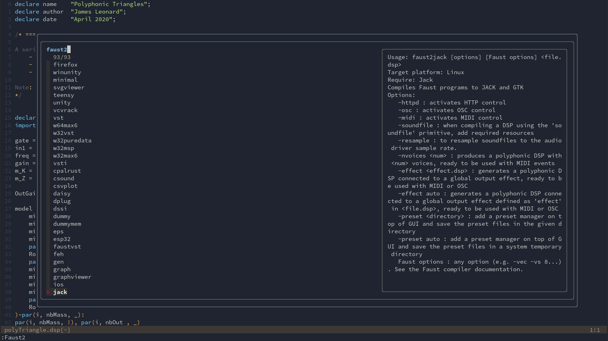
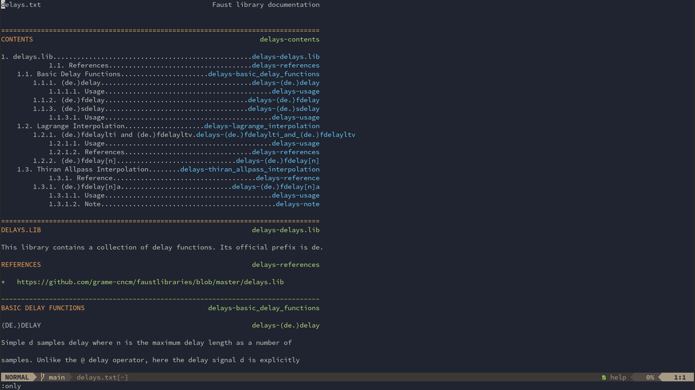

# Faust integration for NeoVim

 

 

- Commands for compiling and installing as SuperCollder UGens, to Teensy and others
- Fuzzy find examples
- Faust documentation is available as native vim documentation after runnning `:FaustGenerateHelp`. Then you can for example run `:h delays.lib.`
- Commands for looking up docs on the web
- Correct comment string for faust filetype
- Faust snippets (snippets.nvim format)
- Other small handdy bits and pieces

# Requirements
- MacOS or linux system
- Nvim >= v0.6, there is support for 0.7 autocmd, filetype, etc.
- faust
- [nvim-fzf](https://github.com/vijaymarupudi/nvim-fzf)
- wget and tar (for help file converter)

# installation

Using packer.nvim
```lua
use {
    'madskjeldgaard/faust-nvim',
		-- run = require'faust-nvim'.post_install, -- Generate documentation etc (currently doesn't work it seems)
        config = function()
            require 'faust-nvim'.setup()
            require 'faust-nvim'.load_snippets()
        end,
        requires = {
			'vijaymarupudi/nvim-fzf',
            'L3MON4D3/LuaSnip'
		}
}
```

## Options

Change these options if the values are difference for your system:
```lua
-- Location of faust examples
vim.g.faust_examples_dir = "/usr/share/faust/examples"
-- Location of faust binaries
vim.g.faust2appls_dir = "/bin/"
-- Location of faust libraries
vim.g.faustlib_dir = "/usr/share/faust/"
```

# Commands
## The Faust2 command
 

The plugin comes with the `:Faust2` command which will compile the file that you are in using any of the faust2appl-scripts.

You can either run `:Faust2` to get a fuzzy finder selection of the different choices and execute the chosen one, or you can autocomplete the command by writing. For example by just typing `s` and hitting tab: `:Faust2 s<tab>`. Lastly, you can invoke the directly like so: `Faust2 puredata`.

Additionally, anything after the chosen script's name is added to the invocation of the command as additional flags and arguments behind the scenes. For example, to compile SuperCollider UGen's with the `-s` (for SuperNova) option: `:Faust2 sc.py -s`.

## Help files
 

By running `:FaustGenerateHelp`, faust-nvim will download a binary to convert markdown files to vim files and convert all faust library files to vim help. After this, it is possible to open the faust documentation as if it was any other vim help file, eg `:h delays`.

If you have FzfLua installed (recommended) or similar fuzzy finders that can search through help_tags in neovim, you can run commands such as `:FzfLua help_tags` and fuzzy search for the documentation, eg try typing `limiter`.

